# ROMA.SYS

**羅馬紀 · 兩千年後的舉牌** —— 一部跑在瀏覽器裡的敘事遊戲。左手是可以無限寫下去的文字劇本，右手是一座可以走進去、蓋起來、拆掉重來的三維城邦。

打開 `index.html` 即可遊玩，不需安裝、不需後端；一切進度、設置與密鑰只留在你自己的瀏覽器裡。

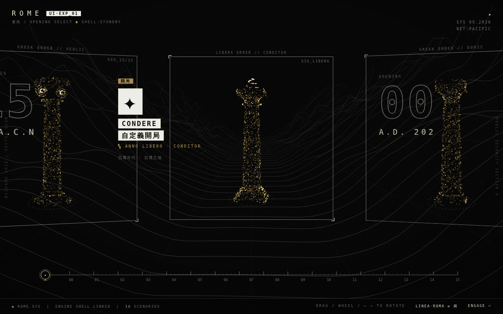

---

## 目錄

- [快速開始](#快速開始)
- [兩條線](#兩條線)
- [開局](#開局)
- [主界面](#主界面)
- [三維天下](#三維天下)
- [輿圖與遠行](#輿圖與遠行)
- [裝備行囊](#裝備行囊)
- [設置 · 控制中樞](#設置--控制中樞)
- [存檔與備份](#存檔與備份)
- [幕間樂](#幕間樂)
- [手機版](#手機版)
- [資料與隱私](#資料與隱私)
- [目錄結構](#目錄結構)

---

## 快速開始

1. 下載或克隆本倉庫；
2. 用瀏覽器打開根目錄的 `index.html`（或架任意靜態伺服器指向根目錄）；
3. 頂欄 **ORACVLVM** 填入 OpenAI 相容接口的 BASE URL、密鑰與模型名，即可讓劇情跑起來。

沒有接口也能玩：三維城邦、輿圖、裝備、營造全部可用，只是不會有新的劇情文字。

推薦 Chrome / Edge / Safari 新版。三維部分吃 WebGL，老機器可在設置裡切「低配」或「純文字」。

---

## 兩條線

| 線 | 主角 | 舞台 |
|---|---|---|
| **ROMA · 貝羅娜線** | 貝羅娜，羅馬戰爭女神 | 環地中海世界，16 個開局 |
| **周 · 天子線** | 姬瑤，女扮男裝即位的周天子 | 中原列國，15 個開局 |

兩條線共用一套引擎與存檔體系，選局環左下角 **LINEA** 一鍵切換。世界書分別內置 383 條與 177 條詞條，正文提到即自動注入設定。

---

## 開局

### 選局環

十六根粒子柱在三維環上排開，每根對應一個開局，柱式按年代與地域分屬希臘、羅馬、埃及三系共 17 種。拖動、滾輪或方向鍵轉環，**ENGAGE** 入局。

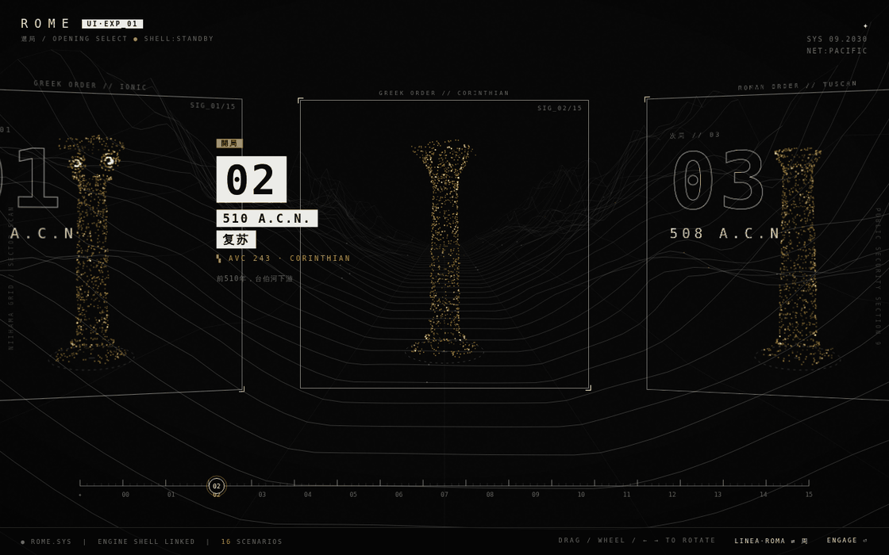

### 自定義開局

環上第一根 **CONDERE · 自定義開局** 是留給你自己的：先寫年代（前 800 — 公元 476，或 1800 — 2100 的現代），再轉動地球在百餘座古今城邑裡挑一處落腳，最後選人物。

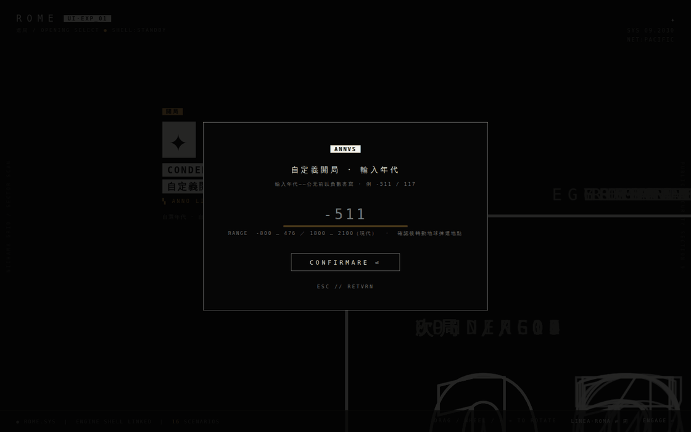

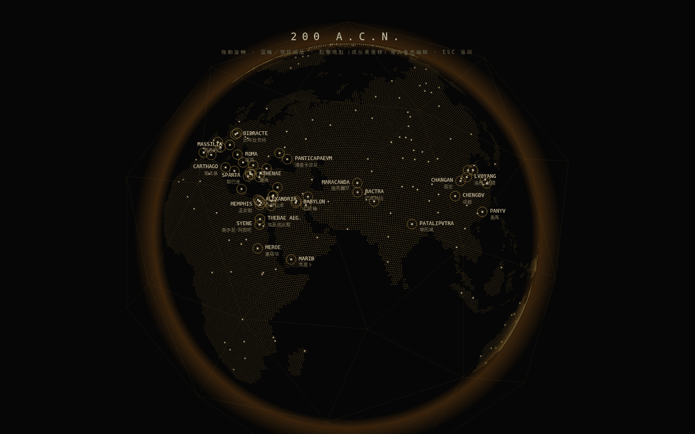

地球上只亮出該年代真實存在的城市——選前 200 年，龐貝還在、君士坦丁堡還沒有；選 1900 年，紐約與東京自然接上。拖動旋轉、雙指或滾輪縮放，點地標即可定為開局之地。

### 主菜單

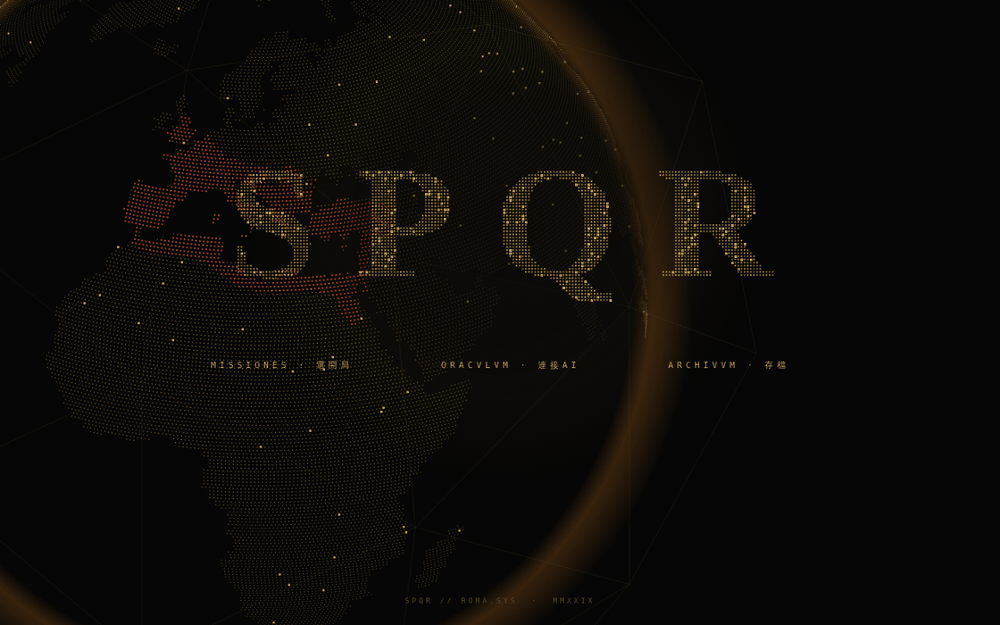

粒子地球托著 SPQR 字樣。有局在身時左側會多出 **REDIRE · 繼續遊戲**，回到剛才那一局；**MISSIONES** 重選開局，**ORACVLVM** 配置接口，**ARCHIVVM** 讀寫存檔。

---

## 主界面

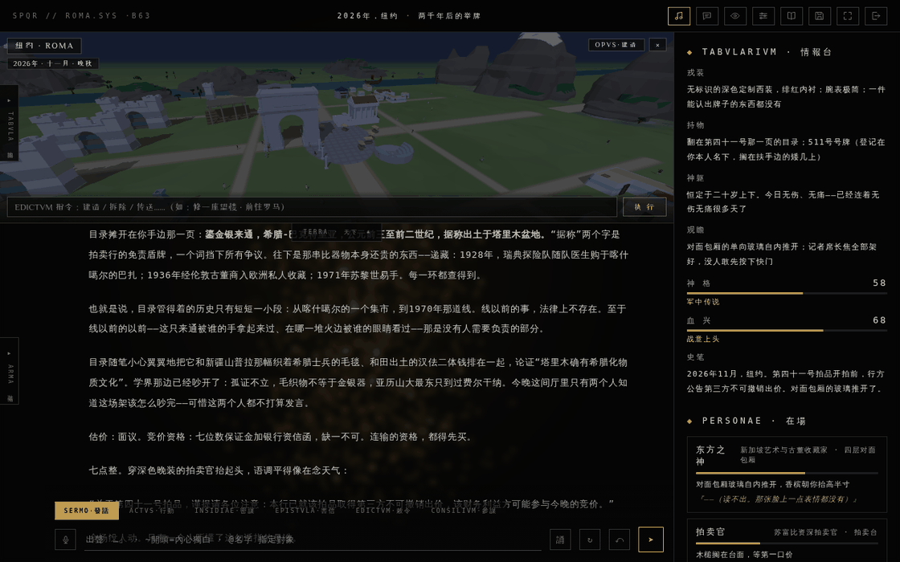

三欄：頂上是三維天下，中間是敘事正文，右側是 **TABVLARIVM · 情報台**（狀態欄）。

### 敘事與六種說法

輸入框上方六個模式，決定你這一句以什麼身分說出去：

| 模式 | 作用 |
|---|---|
| **SERMO · 發話** | 出聲說話；`~` 開頭寫內心獨白，`@名字` 指定對象 |
| **ACTVS · 行動** | 描述動作，具體到手和腳 |
| **INSIDIAE · 密謀** | 暗線，只有你與同謀可見 |
| **EPISTVLA · 書信** | 修書一封 |
| **EDICTVM · 敕令** | 以權威發布命令，消耗威望 |
| **CONSILIVM · 參謀** | 向幕僚求策，列出局勢與選項 |

正文右下角三枚小鍵：**誦**（朗讀本幕）、**↻**（重演這一幕）、**⤺**（捨棄其後劇情回到上一幕）。麥克風可語音輸入。

### 情報台 MVU

右欄實時反映當前狀態：衣裝、持物、神軀、觀瞻等文字欄，神格與血興等量表，以及在場人物卡。全部由劇情驅動，不需手動維護。

---

## 三維天下

頂部那條 **TERRA · 天下** 拉手管著整個三維世界：點一次放大一檔（條 → 中景 → 大景 → 收起），收起時場景會真正休眠並在 90 秒後釋放顯存，不會偷偷佔著記憶體。

### 營造 · OPVS

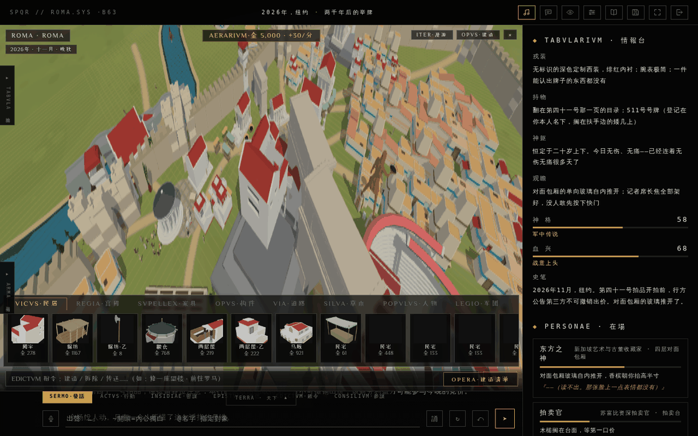

俯視全城，底下是營造清單：**市井 / 王室 / 家具 / 構件 / 道路 / 草木 / 人物 / 軍旅** 八類，518 件模型全部可選可放。拖轉視角、雙指縮放、點格落成；建成物可再選中、旋轉、遷移或拆毀。左上角國庫按分鐘生息，右上 **ACTA · 通報** 把這一輪的興作毀損寫成奏報發給劇情。

也可以直接在下方 **EDICTVM 指令**欄用一句話造：「修一座望樓」「拆掉東邊的糧倉」「前往羅馬」。

### 漫遊 · ITER

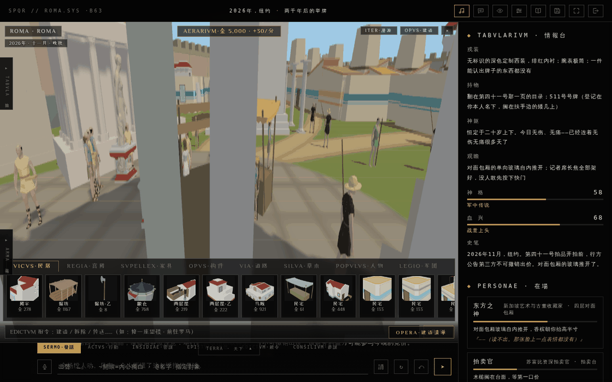

WASD 走進城裡。街上是穿著真實服裝的市民——18 套希臘羅馬服飾、21 件髮型頭盔配件，走路時手臂與雙腿自然擺動。點任何人可以對話，或者拔劍攻擊（動作播完自動把這一擊寫進劇情，由神諭裁斷後果）。凡成屋之形者皆可推門進去。

大城常駐近百名居民，另有 25 位歷史人物按地點出沒；軍旅四種編制（軍團兵 / 一什 / 百人隊 / 大隊）可招募佈陣。

### 城邑

45 座城市各有形制：羅馬按塞維安城牆十三頂點八門、台伯河反 S 曲流、七丘台地、廣場圍合、鬥獸場谷地與十五連拱引水道從零重建；雅典、斯巴達、迦太基、亞歷山卓、敘拉古、拜占庭、科林斯、德爾斐等另有各自藍圖（迦太基的圓形軍港與三重陸牆、德爾斐的山階神域等）。其餘地名按區域、年代、規模程序生成，中原諸城則交由另一套引擎接手——輿圖上點洛邑、咸陽、臨淄，畫面即刻換成中式城池。

海洋與河流無限延伸，山脈按走向成嶺、兩端漸低，樹木依氣候帶分佈。

---

## 輿圖與遠行

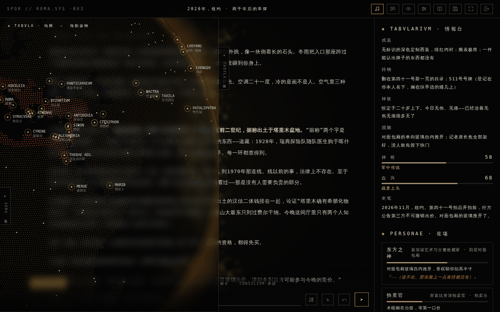

左側拉手展開粒子地球。點任一地標即出簡介與確認，**啟程**後三維畫面立刻隨行到目的地，同時把趕路這一輪交給劇情去寫。拖動旋轉、滾輪或雙指縮放。

---

## 裝備行囊

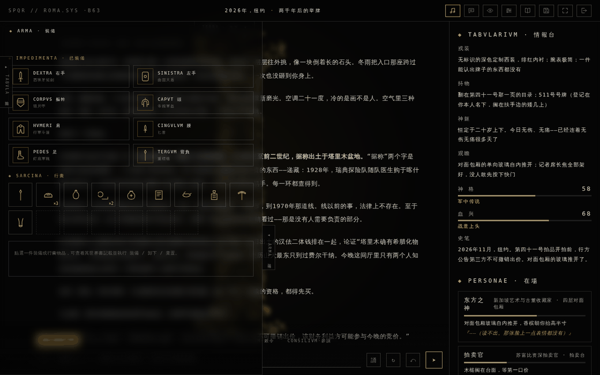

九個部位（右手 / 左手 / 軀幹 / 頭 / 肩 / 腰 / 足 / 背 / 頸）加行囊。裝備賬目會隨每輪注入劇情——不在賬上的東西就不在身上，取用裝卸都得在正文交代動作，新物件必須有來源（軍需、繳獲、市集）。

---

## 設置 · 控制中樞

十二個頁籤，逐一鋪開：

### 圖 · 生圖

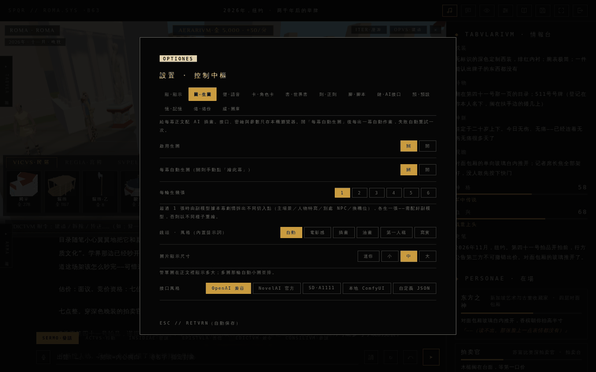

給每幕正文配插畫。支援 **OpenAI 兼容 / NovelAI 官方 / SD·A1111 / 本地 ComfyUI / 自定義 JSON** 五種後端，每輪 1—6 張（多張時由副模型拆出不同切入點：主場景、人物特寫、別處 NPC、換機位），六種鏡頭風格，四檔顯示尺寸，步數 / CFG / 尺寸 / 種子全可調。另有生圖世界書：觸發詞命中正文時自動追加英文片段到畫面提示詞。

### 其餘頁籤

| 頁籤 | 內容 |
|---|---|
| **顯 · 顯示** | 毛玻璃濃度、版式（自動 / 電腦 / 手機）、字體字號、打字機速度、自定義字體上傳 |
| **聲 · 語音** | 朗讀正文：瀏覽器內置零配置，或走 OpenAI 兼容 `/audio/speech`；朗讀範圍可限定台詞或旁白 |
| **卡 · 角色卡** | 導入酒館格式角色卡（PNG 內嵌數據 / V2·V3 JSON），入局即成世界書條目 |
| **書 · 世界書** | 兩條線各自的內置詞條瀏覽，可自寫條目或匯入 JSON |
| **則 · 正則** | 對模型輸出做替換與清洗 |
| **腳 · 腳本** | 事件鉤子腳本 |
| **鏈 · AI接口** | 主模型、副模型、採樣參數 |
| **預 · 預設** | 常駐提示詞多套管理，按序注入 |
| **憶 · 記憶** | 長程記憶編年長卷，自動摘要既定事實，可手改可導出 |
| **備 · 備份** | 見下 |
| **緩 · 圖庫** | 本機圖片緩存瀏覽、單張刪除、一鍵清空 |

### 世界書

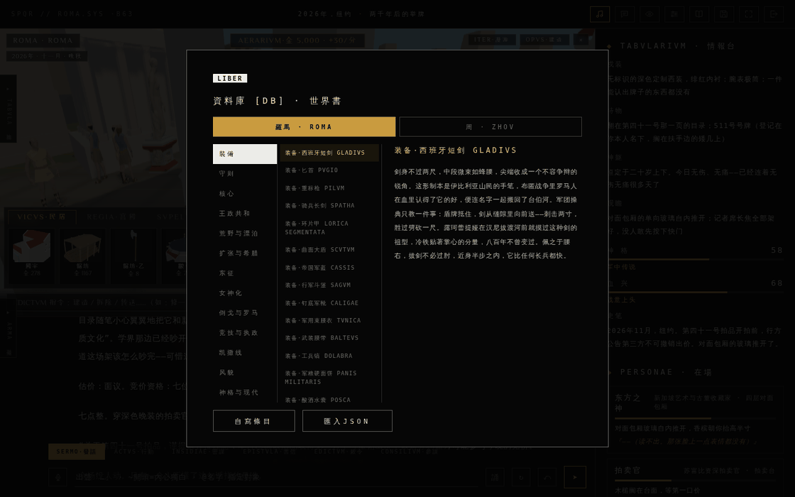

---

## 存檔與備份

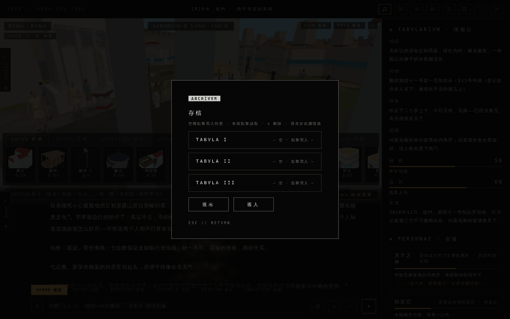

三個存檔位，寫入即快照當前劇情、狀態、裝備與城建；匯出匯入為 JSON。

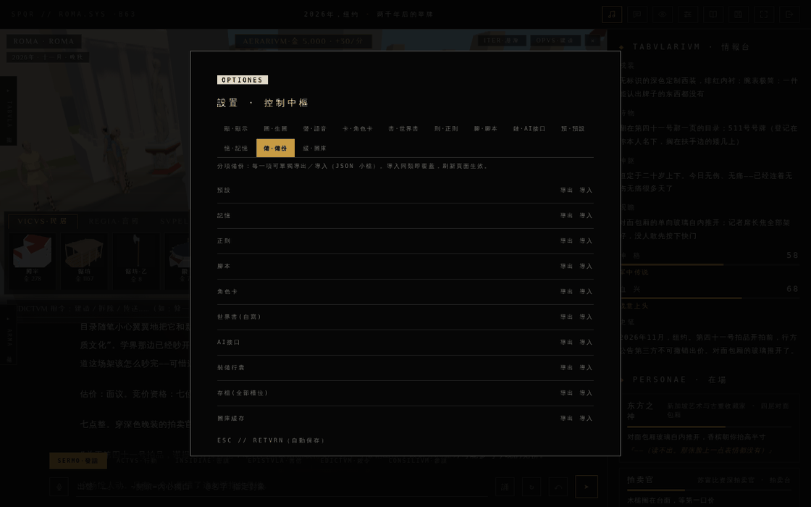

**備 · 備份** 頁提供十一類分項導出／導入——預設、記憶、正則、腳本、角色卡、自寫世界書、AI接口、裝備行囊、全部存檔、圖庫緩存、其他設置，每類單獨一個小 JSON，導入時自動識別類別。另有全量備份一鍵帶走。

一鍵清除為兩段式：先列出將被刪除的每一項讓你過目，再點一次才執行。

---

## 幕間樂

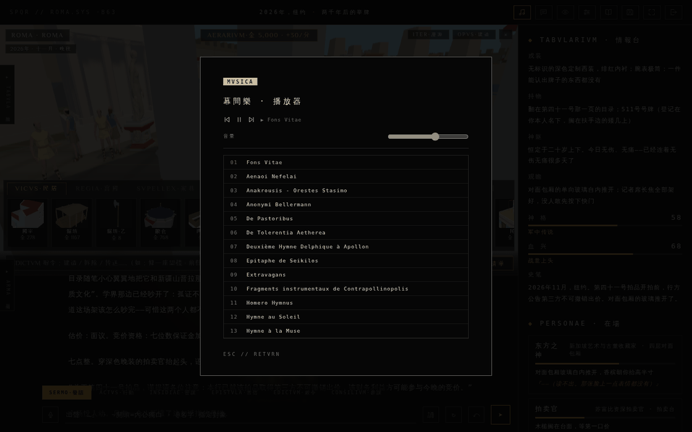

內置 47 首曲目：古希臘與古羅馬復原音樂 34 首（德爾斐頌歌、塞基洛斯墓志銘、俄瑞斯忒斯合唱段等），另有 13 首電子配樂。進入遊戲自動起樂，首曲 *Fons Vitae*，放完自動續下一首並循環。

點頂欄音符打開播放器：全曲目點播、上下曲、音量記憶。

---

## 手機版

<p align="center">
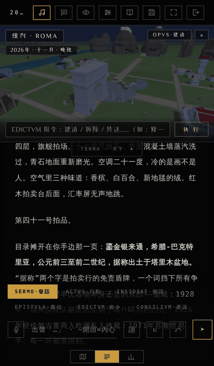
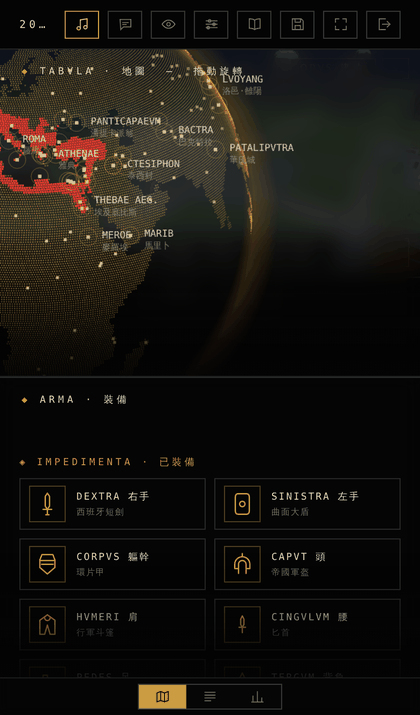
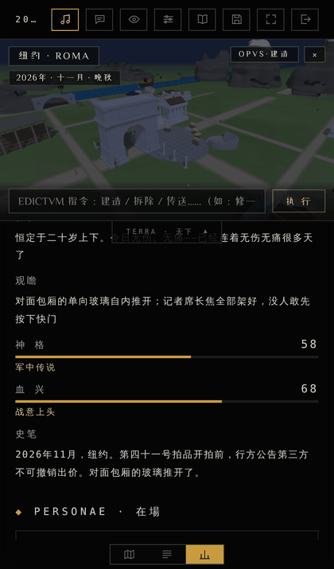
</p>

三維、輿圖、裝備、營造、設置全部可用，不是閹割版：

- 底部小島三鍵切頁（輿圖裝備 / 敘事 / 情報），可點可左右滑；
- 輿圖與裝備合成上下一頁，一屏看全；
- 地球雙指縮放、雙指平移、單指旋轉；
- 三維默認開啟，三檔高度按手機屏重排；
- 背景粒子柱在手機端不啟動，省下記憶體與每幀開銷。

---

## 資料與隱私

- 全部資料只存在你這台設備的 `localStorage`：設置、接口密鑰、預設、記憶、正則、腳本、角色卡、世界書、存檔、裝備、圖庫。
- 沒有帳號、沒有伺服器、沒有任何統計或上報。
- 接口密鑰只在你的瀏覽器與你自己填的接口地址之間往返。
- 換設備靠備份頁的 JSON 導出導入。

---

## 目錄結構

```
index.html                     單文件應用：界面、劇情引擎、輿圖、設置、播放器
core/
  three-bundle.min.js          三維運行時
  vendor/three/build/chunks/   兩套城邦引擎（環地中海 / 中原）
  res/data/idx/v1/*.dat        資材包：模型、貼圖、樂曲
docs/img/                      本文檔截圖
```

資材以哈希命名的容器存放並做了混淆，運行時在本機還原。

---

## 開場

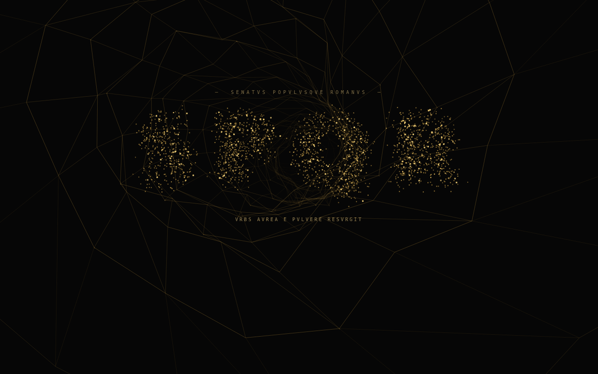
